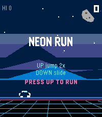
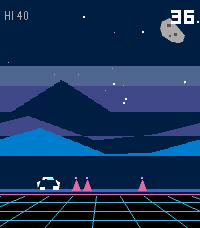

# NeonRun

A neon side-scrolling runner for the Pebble Time 2 (emery platform). You play an astro-cat sprinting through a synthwave city: jump over spikes, double-jump through crystal trails, slide under patrol drones, and chain pickups into score multipliers.

## Screenshots

<p align="center">
  
  
</p>

## Gameplay

- Auto-runner with progressive speed ramp-up
- Jump and double jump to clear spikes and reach crystal lines
- Hold DOWN to fast-fall and slide under hover drones
- Crystal streaks multiply your score (x2, x3, ...) with haptic feedback
- Personal best is persisted between sessions

## Controls

| Button | Action |
|--------|--------|
| SELECT | Jump / double jump |
| DOWN (hold) | Slide / fast-fall |
| UP | Start / pause / resume |

## Build

Requires the Pebble SDK toolchain (`pebble-tool`):

```bash
pebble build
```

Ready-to-install `.pbw` files are available on the [releases page](../../releases).
